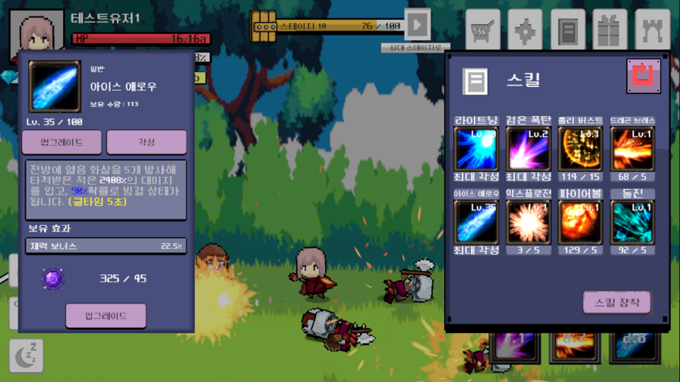
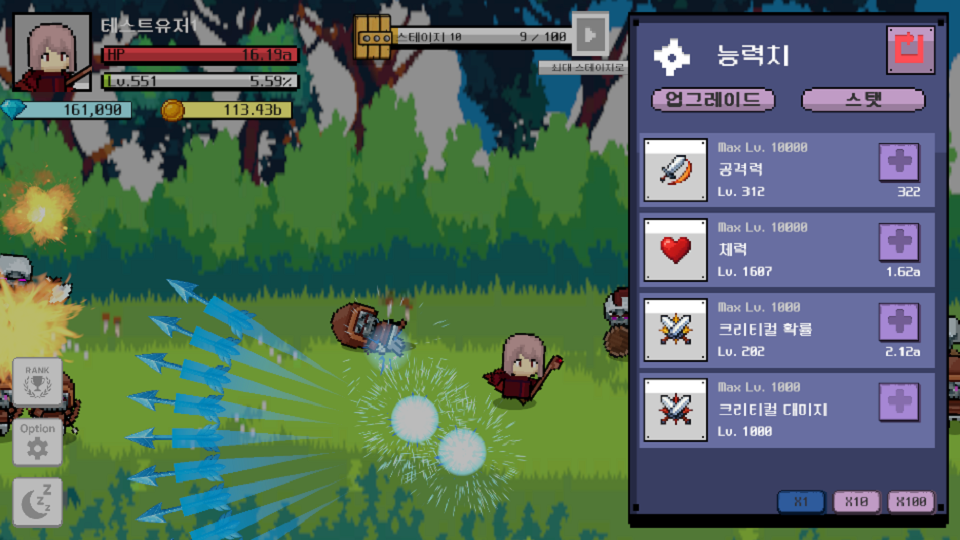
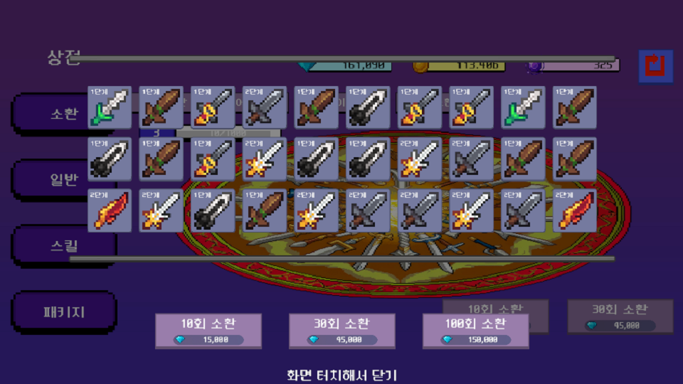

# 마법사 키우기 Idle Magician

## 📌 개요
- 장르 : 2D 방치형 RPG
- 플랫폼 : Android
- 엔진 : Unity 2022.3.50f1
- 기간 : 2025.06.02 ~ 2025.08.27 (12주)
- 목표 : 상용 방치형 RPG와 유사한 구조를 직접 구현하고, 서비스에 필요한 핵심 기능들을 경험

## ✨ 주요 기능
- 전투 시스템 : FSM기반 플레이어/몬스터 AI, 자동 이동 및 공격, 크리티컬 확률 및 대미지 처리
- 스킬 시스템 : CSV 기반 데이터 관리, 쿨타임 처리, 팩토리 패턴으로 확장성 확보, 스킬 강화, 각성에 따라 다른 효과 적용, 스킬 장착 UI 구현
- 인벤토리 : 장비 아이템 강화/합성/장착, 보유 효과 및 장착 효과 지원
- 소환 시스템 : 게임 내 재화를 사용해 확률 테이블 기반 아이템, 스킬 소환
- 최적화 : 제네릭 기반 풀링 구조 설계 및 Stack 자료구조로 최적화, Coroutine 대신 Delay Call Manager 도입으로 상태머신 부하 최소화
- 데이터 관리 : CSV 기반 테이블 로딩, GitHub Pages를 통한 무점검 패치, Firebase Realtime DB, Google Auth로 실시간 저장/불러오기 및 계정 연동
- 현지화 : 런타임 중 언어 변경 지원
- 수익화 : Google AdMob 전면 광고 및 보상형 광고 지원 (Google Billing 기반 광고 제거 패키지는 추후 예정)

## 🛠 기술 스택
- Engine : Unity 2022
- Language : C#
- DB : Firebase (Realtime Database, Authentication)
- Library / SDK : UniTask, DOTween, NewtonSoft, Google AdMob, Google Auth

## 🖼 스크린샷

## 🧾 배운점
- 데이터 주도형 설계 : CSV 기반 데이터 관리로 밸런싱, 확장성을 고려한 시스템 설계 경험
- 클라우드 연동 경험 : Firebase Realtime Database의 비동기 처리 흐름 이해 및 적용
- 성능 최적화 경험 : 오브젝트 풀링과 딜레이 콜 매니저를 통한 성능 개선
- 설계 패턴 적용 : 인터페이스 기반 추상화, 유한 상태머신, 팩토리 패턴 적용을 통한 유지보수성과 확장성 향상

## 📥 다운로드
- [Android APK] 
